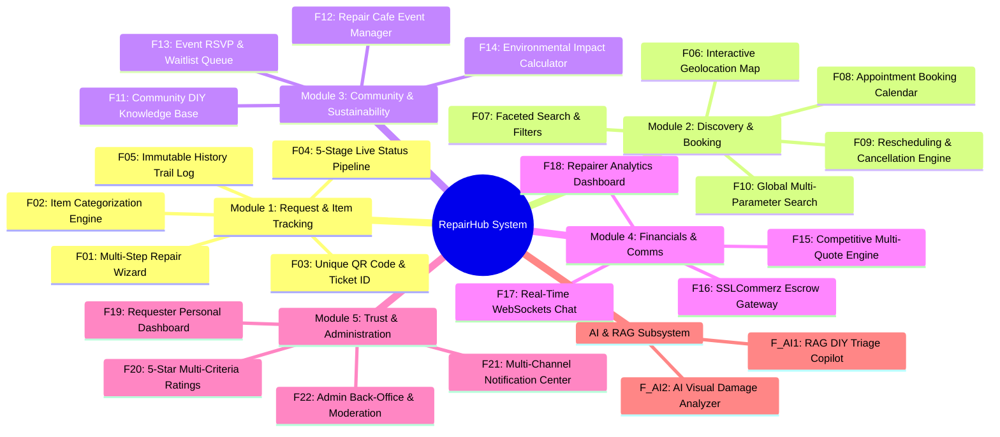

# BRAC UNIVERSITY
## Department of Computer Science and Engineering
### CSE470: Software Engineering — Summer 2026

---

# Software Requirements Specification (SRS)
## Project Title: **RepairHub**
### *A Circular Economy Platform for Community & Professional Item Repairs*

---

### **Document Information**
- **Document Version**: 1.0.0
- **Course**: CSE470 — Software Engineering
- **Lab Section**: 06
- **Group Number**: 06
- **Submission Date**: Summer 2026

### **Author Group & Contribution Matrix**
| SL | Student ID | Student Name | Role / Focus Area | Contribution |
| :---: | :---: | :---: | :---: | :---: |
| 1 | **23201227** | **Tabassum Subah Upoma** | Module 1: Request & Physical Item Tracking | 25% |
| 2 | **23201444** | **Sreema Roy** | Module 2: Discovery, Geolocation & Booking Engine | 25% |
| 3 | **23201427** | **Avishek Biswas** | Module 4 + AI Subsystem: AI/RAG, Real-Time WebSockets & Escrow | 25% |
| 4 | **23201436** | **Mohammad Zubair Zaman** | Module 3, 4 & 5: Sustainability, Events, Dashboards & Governance | 25% |

---

# 1. Introduction

## 1.1 Type of Project
**RepairHub** is a full-stack, web-based circular economy marketplace and physical item tracking platform. It bridges the gap between individuals with broken consumer goods (electronics, household appliances, furniture, garments, bicycles) and skilled repairers (local professional repairers and volunteer fixers), while also serving as an organizing hub for walk-in community **Repair Café** events.

## 1.2 Purpose
The global surge in e-waste and consumer product obsolescence has caused severe environmental degradation. Most people discard repairable items due to:
1. High search friction in finding reliable local technicians.
2. Complete absence of price transparency and fear of overcharging.
3. Lack of physical item tracking and trust during handover.
4. Ignorance of safe DIY troubleshooting methods and their positive carbon impact.

**RepairHub** addresses these challenges by providing:
- A transparent, multi-quote bidding system with **SSLCommerz escrow security**.
- An end-to-end **physical item tracking pipeline** using scannable QR tokens and digital tickets.
- An **interactive map** of verified technicians and free community Repair Cafés.
- A **RAG-powered AI Repair Copilot** with safety triage and vision damage detection.
- A real-time **Environmental Impact Tracker** computing kilograms of e-waste diverted and CO₂ emissions saved.

## 1.3 Target Users
1. **Requesters (Consumers/Item Owners)**: Individuals seeking convenient, affordable, and safe repairs for household items, appliances, electronics, and clothing.
2. **Repairers & Technicians (Taskers)**: Independent tradespeople, freelance technicians, and local repair shops wanting to discover nearby repair jobs, submit quotes, manage earnings, and build verified reputations.
3. **Event Organizers & Volunteers**: Community advocates organizing non-profit Repair Café workshops to promote zero-waste living.
4. **Platform Administrators**: Back-office staff responsible for KYC identity verification, dispute resolution, and content moderation.

---

# 2. Functional Requirements (FRs)

The system encompasses **22 Core Evaluated Functional Features** distributed evenly across the 4 team members (plus baseline Authentication infrastructure).

---

## 2.1 Module 1: Repair Request & Physical Tracking (Tabassum Subah Upoma - 23201227)

- **FR-01: Multi-Step Repair Request Wizard**
  - **Description**: Requesters can post a new repair job via an interactive wizard, providing item title, category/sub-category, description of defect, multiple photo uploads, pickup/drop-off/mail-in preference, and geographic coordinates.
  - **Acceptance Criteria**: Form validates required inputs; uploads images; persists record in `RepairRequest` collection; returns HTTP 201 Created.

- **FR-02: Hierarchical Item Categorization System**
  - **Description**: Organizes items into standardized categories (*Consumer Electronics, Large Appliances, Furniture, Textiles/Clothing, Bicycles, Mechanical*) with tailored diagnostic prompts per category.
  - **Acceptance Criteria**: Dynamic dropdowns; auto-assigns category-specific carbon and e-waste baseline coefficients.

- **FR-03: Unique QR Code & Repair Ticket ID Generator**
  - **Description**: Generates an alphanumeric tracking ticket ID (e.g. `RH-2026-8492`) and a scannable Base64/SVG QR code token upon booking.
  - **Acceptance Criteria**: QR contains encrypted validation payload (`ticketId`, `requesterId`, `timestamp`); verifiable by repairer camera/scanner during physical drop-off and pickup.

- **FR-04: 5-Stage Live Status Tracking Pipeline**
  - **Description**: Implements a strict finite-state-machine: `Requested` ➔ `Quoted` ➔ `In Progress` ➔ `Ready for Pickup` ➔ `Completed` (with `Cancelled` exit state).
  - **Acceptance Criteria**: State transitions require proper role permissions; invalid transitions (e.g. `Completed` ➔ `Requested`) are rejected with HTTP 400.

- **FR-05: Immutable Item Audit & History Log**
  - **Description**: Records every lifecycle transition, quote update, and handover scan in an append-only time-stamped history log (`ItemHistoryLog`).
  - **Acceptance Criteria**: History entries cannot be modified or deleted; visible on both requester and repairer dashboards for dispute transparency.

---

## 2.2 Module 2: Discovery, Geolocation & Booking Engine (Sreema Roy - 23201444)

- **FR-06: Interactive Geolocation Map View (Leaflet / OpenStreetMap)**
  - **Description**: Displays an interactive map rendering nearby verified repair workshops and upcoming Repair Café events with custom map pins.
  - **Acceptance Criteria**: Uses user's browser geolocation; renders interactive popups with distance, ratings, and booking shortcuts.

- **FR-07: Faceted Repairer Search & Multi-Criteria Filtering**
  - **Description**: Users can filter technicians using MongoDB `$near` geospatial indexing, category specialties, minimum star rating, price tier, and verified trust badges.
  - **Acceptance Criteria**: Returns paginated results within milliseconds; updates map viewport dynamically.

- **FR-08: In-App Appointment Booking System**
  - **Description**: Requesters select specific date and hourly time-slots from a repairer's weekly availability calendar.
  - **Acceptance Criteria**: Prevents double-booking conflicts on identical time slots; confirms reservation instantly.

- **FR-09: Rescheduling & Booking Cancellation Engine**
  - **Description**: Requesters and repairers can cancel or reschedule bookings with automated cross-party notification and calendar slot release.
  - **Acceptance Criteria**: Updates `Booking` status to `cancelled`; triggers webhook/socket notification to the counterparty.

- **FR-10: Global Multi-Parameter Search**
  - **Description**: Unified search bar with autocomplete across active repair requests, upcoming events, and community DIY articles.
  - **Acceptance Criteria**: Text index searching over titles, tags, and category names.

---

## 2.3 Module 3: Community Repair Cafés & Sustainability (Mohammad Zubair Zaman - 23201436)

- **FR-11: Community Repair Café Event Manager**
  - **Description**: Organizers can post community repair events specifying date, time, venue address, geolocation, volunteer skill requirements, and maximum capacity.
  - **Acceptance Criteria**: Validates future dates; pins event to interactive map; lists under upcoming community events.

- **FR-12: Event RSVP & Automated Waitlist Queue**
  - **Description**: Users RSVP as *Attending* or *Interested*. When capacity is exhausted (`currentRSVP >= maxCapacity`), subsequent users are added to a FIFO waitlist.
  - **Acceptance Criteria**: When an attendee cancels, the system automatically promotes waitlist position #1 to *Attending* status and sends an alert.

- **FR-13: Environmental Impact Tracker & Circular Economy Calculator**
  - **Description**: Calculates estimated kilograms of e-waste diverted and CO₂ emissions prevented upon every repair completion using EPA/WEEE benchmark coefficients.
  - **Acceptance Criteria**: Aggregates cumulative statistics on user and platform dashboards; unlocks green achievement badges (e.g. *"Carbon Saver - Tier 1"*).

- **FR-14: Requester Personal Dashboard**
  - **Description**: Comprehensive user dashboard displaying active repair pipelines, past ticket history, bookmarked repairers, and total environmental savings.
  - **Acceptance Criteria**: Live reactive updates when ticket states change.

- **FR-15: 5-Star Multi-Criteria Rating & Review System**
  - **Description**: Upon job completion, customers submit reviews rating the repairer across 3 dimensions: *Quality of Work*, *Communication*, and *Turnaround Time*.
  - **Acceptance Criteria**: Calculates weighted average rating; displays verified purchase tag; updates repairer profile score.

- **FR-16: Admin Back-Office & Moderation Panel**
  - **Description**: Admin interface to review repairer KYC documents (National ID/Trade License), grant Trust Badges, mediate dispute tickets, and view platform metrics (GMV, total repairs).
  - **Acceptance Criteria**: Role-restricted access (`role === 'admin'`); ban/unban user capabilities.

---

## 2.4 Module 4 & AI Subsystem: AI/RAG, Real-Time Comms & Escrow (Avishek Biswas - 23201427)

- **FR-17: RAG-Powered AI DIY Repair Copilot & Safety Triage Engine**
  - **Description**: Conversational diagnostic assistant grounded on local indexed repair manuals and schematics stored in a **ChromaDB** vector database with `all-MiniLM-L6-v2` embeddings.
  - **Acceptance Criteria**: Retrieves top-k relevant troubleshooting steps; injects mandatory safety warnings for high-voltage and chemical hazards; eliminates hallucinations.

- **FR-18: AI Visual Damage Assessment & Auto-Tagger**
  - **Description**: Multimodal Computer Vision analyzer that inspects uploaded broken item photos to detect device category, defect severity, and repair difficulty score.
  - **Acceptance Criteria**: Returns structured JSON with detected object, defect description, and recommended category within 2 seconds.

- **FR-19: SSLCommerz Payment Gateway & Escrow Release Engine**
  - **Description**: Full transaction lifecycle integration with SSLCommerz Sandbox. Customer payment is authorized and held in **Escrow** upon booking acceptance, and only released to the repairer when the customer verifies item pickup via QR code.
  - **Acceptance Criteria**: Handles IPN payment callbacks, status validation, escrow state locking (`held_in_escrow`), and payout trigger (`released_to_repairer`).

- **FR-20: Real-Time WebSockets In-App Messaging & Media Sharing**
  - **Description**: Bi-directional real-time chat between customer and assigned repairer using Socket.io rooms, supporting instant messaging, image attachments, and typing indicators.
  - **Acceptance Criteria**: Sub-100ms message delivery; persists chat history to MongoDB; offline notification delivery.

- **FR-21: Community DIY Repair Knowledge Feed & Multimedia Guides**
  - **Description**: Interactive community feed where users post illustrated repair guides, tips, comments, and upvotes; newly published guides are automatically embedded and indexed into the RAG vector store.
  - **Acceptance Criteria**: Supports markdown formatting, step-by-step images, comment threads, and automatic vector indexing.

- **FR-22: Competitive Multi-Quote & Bidding Engine**
  - **Description**: Allows repairers to inspect posted requests in their category and submit itemized cost and duration estimates; customers compare bids side-by-side and accept one.
  - **Acceptance Criteria**: On quote acceptance, auto-rejects competing bids and initiates the escrow payment flow.

---

# 3. Non-Functional Requirements (NFRs)

## 3.1 Performance & Scalability
- **API Latency**: REST API endpoints shall respond in under **200ms** under normal load.
- **RAG Retrieval Speed**: Vector similarity search in ChromaDB shall complete in under **50ms** on standard CPU.
- **Real-Time Sync**: Socket.io message propagation latency shall be under **100ms**.
- **Page Load Time**: Initial frontend load time shall be under **1.5 seconds** via Vite code splitting and asset optimization.

## 3.2 Security & Data Protection
- **Authentication**: Stateless JSON Web Tokens (JWT) signed with HMAC-SHA256, transmitted via Secure HTTP headers.
- **Password Security**: Passwords hashed with **bcryptjs** (salt rounds = 10).
- **Payment Security**: SSLCommerz transactions validated via server-to-server IPN hash validation.
- **Input Sanitization**: All user inputs sanitized to prevent XSS (Cross-Site Scripting) and NoSQL injection attacks.

## 3.3 Reliability & Availability
- **Uptime Target**: 99.5% availability for core REST services.
- **Fault Tolerance**: Graceful fallback to mock sandbox modes if external APIs (SMS/Payment/AI) experience network interruptions.
- **State Integrity**: Atomic MongoDB operations for booking slots, waitlist increments, and escrow fund status.

## 3.4 Usability & Accessibility
- **Responsive Design**: Fluid UI matching standard desktop (1920x1080), laptop (1366x768), tablet (768x1024), and mobile (375x812) viewports.
- **Accessibility**: High contrast visual ratios, clear icon labels, and keyboard-navigable forms.

---

# 4. System Class Diagram (Mermaid.js)

```mermaid
classDiagram
    %% Inheritance Hierarchy
    User <|-- Requester
    User <|-- Repairer
    User <|-- Admin

    %% User Relations
    Requester "1" --> "0..*" RepairRequest : creates
    Requester "1" --> "0..*" Review : writes
    Requester "1" --> "0..*" Booking : books
    Repairer "1" --> "0..*" Quote : submits
    Repairer "1" --> "0..*" Booking : fulfills
    Repairer "1" --> "0..*" RepairCafeEvent : organizes
    Repairer "1" o-- "0..*" Waitlist : maintains
    Repairer "1" --> "0..*" Review : receives
    Admin "1" --> "0..*" Repairer : verifies
    Admin "1" --> "0..*" CommunityPost : moderates
    User "1" --> "0..*" RSVP : makes
    User "1" --> "0..*" Message : sends
    User "1" --> "0..*" Notification : receives
    User "1" --> "0..*" CommunityPost : authors
    User "1" --> "0..*" Comment : writes

    %% Repair Request Aggregations & Compositions
    RepairRequest "1" *-- "1" RepairTicket : generates
    RepairRequest "1" *-- "0..*" ItemHistoryLog : logs
    RepairRequest "1" *-- "0..*" Message : contains
    RepairRequest "1" *-- "0..1" EnvironmentalImpact : contributes
    RepairRequest "1" o-- "0..*" Quote : receives
    RepairRequest "1" --> "0..1" Review : receives
    RepairRequest "1" --> "0..1" Payment : settled by
    RepairRequest "1" --> "0..1" AIDiagnosticReport : analyzed by

    %% Event & Community Relations
    Quote "1" --> "0..1" Booking : leads to
    RepairCafeEvent "1" *-- "0..*" RSVP : receives
    RepairCafeEvent "1" o-- "0..*" Waitlist : maintains
    CommunityPost "1" *-- "0..*" Comment : contains
    
    %% AI & RAG Subsystem Relations
    Requester "1" --> "0..*" AIDiagnosticReport : requests
    AIDiagnosticReport "0..*" ..> "1..*" RAGKnowledgeDoc : retrieves from

    class User {
        -int userId
        -String name
        -String email
        -String passwordHash
        -String phone
        #String address
        #String role
        +register()
        +login()
        +logout()
        +updateProfile()
    }

    class Requester {
        -List~RepairRequest~ requestHistory
        -List~Repairer~ favoriteRepairers
        +createRepairRequest()
        +viewActiveRepairs()
        +startAITriage()
    }

    class Repairer {
        #String businessName
        #List~String~ categories
        -float rating
        -float priceRangeMin
        -float priceRangeMax
        -boolean isVerified
        #Location location
        +submitQuote()
        +updateAvailability()
        +viewEarnings()
    }

    class Admin {
        +verifyRepairerCredentials()
        +moderateDispute()
        +manageFees()
        +removeContent()
    }

    class RepairRequest {
        -int requestId
        -String itemDescription
        ~String category
        -List~String~ photos
        -String issueDescription
        ~String preferredMethod
        #String status
        -DateTime createdAt
        +submit()
        +cancel()
        +updateStatus()
        +verifyHandover()
    }

    class RepairTicket {
        -int ticketId
        -String qrCode
        -String ticketNumber
        -DateTime issuedAt
        +generateQRCode()
        +validateToken()
    }

    class ItemHistoryLog {
        -int logId
        ~String changeType
        ~String note
        -DateTime timestamp
        +addEntry()
    }

    class Quote {
        -int quoteId
        -float price
        ~String message
        #String status
        -DateTime createdAt
        +accept()
        +reject()
        +revise()
    }

    class Booking {
        -int bookingId
        -DateTime scheduledTime
        #String status
        ~String type
        +confirm()
        +reschedule()
        +cancel()
    }

    class RepairCafeEvent {
        -int eventId
        ~String title
        -DateTime date
        ~String location
        -int capacity
        ~String description
        +createEvent()
        +updateEvent()
        +cancelEvent()
    }

    class RSVP {
        -int rsvpId
        #String status
        -DateTime respondedAt
        +updateStatus()
    }

    class Waitlist {
        -int waitlistId
        ~int position
        -DateTime joinedAt
        +notifyWhenAvailable()
    }

    class Message {
        -int messageId
        -String content
        -String photoUrl
        -DateTime sentAt
        ~boolean isRead
        +send()
    }

    class Review {
        -int reviewId
        -int qualityRating
        -int communicationRating
        -int turnaroundRating
        ~String comment
        -DateTime createdAt
        +submitReview()
    }

    class Payment {
        -int paymentId
        -float amount
        ~String method
        -String transactionId
        #String status
        #String escrowStatus
        +processPayment()
        +holdInEscrow()
        +releaseToRepairer()
        +refund()
    }

    class Notification {
        -int notificationId
        ~String type
        -String content
        ~boolean isRead
        -DateTime createdAt
        +send()
        +markAsRead()
    }

    class EnvironmentalImpact {
        -int impactId
        -float wasteDivertedKg
        -float co2SavedKg
        +calculateImpact()
    }

    class CommunityPost {
        -int postId
        ~String title
        ~String content
        -List~String~ images
        -DateTime createdAt
        +createPost()
        +addComment()
    }

    class Comment {
        -int commentId
        -String text
        -DateTime createdAt
        +editComment()
        +deleteComment()
    }

    class AIDiagnosticReport {
        -int reportId
        -String detectedItemType
        -String detectedDefect
        -float severityScore
        -float estimatedCostMin
        -float estimatedCostMax
        -List~String~ safetyWarnings
        -List~String~ suggestedTriageSteps
        -DateTime createdAt
        +runVisionAssessment()
        +generateTriageAdvice()
    }

    class RAGKnowledgeDoc {
        -int docId
        -String title
        -String category
        -String contentChunk
        -List~float~ embeddingVector
        -String sourceManual
        -List~String~ safetyDirectives
        +retrieveRelevantChunks()
    }
```

---

# 5. Tools and Technologies

| Layer / Subsystem | Technology | Purpose & Rationale |
| :--- | :--- | :--- |
| **Frontend UI (View Layer)** | **React.js 18+ (Vite) + TailwindCSS** | High-performance SPA with modern component architecture, rapid HMR, and rich responsive styling. |
| **UI Components & Icons** | **Lucide-React + HeadlessUI** | Sleek, accessible icons and dynamic interactive modal/menu elements. |
| **Mapping & Geolocation** | **Leaflet.js + React-Leaflet + OpenStreetMap** | **100% Free** interactive mapping with zero API key dependencies or usage quotas. |
| **Backend Core (MVC)** | **Node.js + Express.js** | Industry-standard MVC server architecture, robust routing, middleware ecosystem, and non-blocking I/O. |
| **Database & ODM** | **MongoDB Atlas / MongoDB Local (Mongoose)** | Document-oriented JSON storage with native geospatial 2dsphere indexing and schema validation. |
| **Real-Time Engine** | **Socket.io** | Low-latency WebSockets for instant in-app messaging and real-time repair pipeline status broadcasts. |
| **Payment Gateway** | **SSLCommerz Developer Sandbox API** | Comprehensive payment processing with bKash, Nagad, cards, and custom Escrow release lifecycle. |
| **AI / RAG Subsystem** | **Python + FastAPI + ChromaDB + SentenceTransformers** | High-speed local vector database, semantic embeddings, and multimodal damage inspection. |
| **QR Code Engine** | **qrcode (Node.js) + html5-qrcode (Browser)** | Base64 QR token generation and in-browser camera scanning for physical item drop-off/pickup. |
| **Testing Framework** | **Jest + Supertest (Backend) & Pytest (AI)** | Automated unit and integration testing suite for 100% module-by-module quality gating. |

---

# 6. Compatibility with System Environment and OS

- **Operating System Compatibility**:
  - **Server & AI Service**: Compatible with **Windows 10/11**, **Ubuntu/Debian Linux (20.04+)**, and **macOS (Monterey+)** using Node.js v20+ and Python 3.10+.
  - **Client Application**: Cross-platform web application running on any standard modern operating system.
- **Web Browser Compatibility**:
  - Fully compatible and responsive on **Google Chrome (v100+)**, **Mozilla Firefox (v100+)**, **Microsoft Edge (v100+)**, and **Apple Safari (v15+)**.
- **Mobile Compatibility**:
  - Fully responsive Progressive Web App (PWA) layout optimized for mobile viewports on **Android (Chrome)** and **iOS (Safari)**.

---

# 7. Implementation: Feature Breakdown & Mockups

### Feature 1: Multi-Step Repair Request Wizard
- *Description*: Requesters fill in item details, upload pictures, select pickup/drop-off, and preview estimated impact.
- *UI Elements*: Progress indicator bar, image dropzone, category picker, interactive location picker.

### Feature 2: 5-Stage Status Tracking Pipeline
- *Description*: Visual timeline showing current item state from `Requested` to `Completed` with time stamps and action buttons.
- *UI Elements*: Stepper component, active stage highlighting, QR ticket modal trigger.

### Feature 3: Interactive Geolocation Map View
- *Description*: Full-screen interactive map with custom color-coded pins for repair shops, freelance taskers, and upcoming Repair Cafés.
- *UI Elements*: Search filter sidebar, radius slider, popup card preview with booking button.

### Feature 4: RAG-Powered AI Repair Copilot
- *Description*: Interactive chat drawer providing instant step-by-step diagnostic advice, wiring schematics, and safety disclaimers.
- *UI Elements*: Conversational bubble feed, high-voltage warning banners, matching community guide cards.

### Feature 5: SSLCommerz Escrow Payment & Verification
- *Description*: Checkout screen holding funds in secure escrow until customer scans the pickup QR code.
- *UI Elements*: Itemized price quote, SSLCommerz gateway modal, escrow status badge (`HELD` / `RELEASED`).

---

# 8. Challenges & Mitigations

1. **Physical Handover Verification Without Hardware**:
   - *Challenge*: Confirming that an item was actually handed over and returned.
   - *Mitigation*: Implemented a signed digital QR code token generated on booking confirmation; the repairer scans the customer's QR code on drop-off and pickup to advance the state machine.
2. **AI Hallucinations in Technical Diagnostics**:
   - *Challenge*: LLMs providing incorrect or dangerous electrical advice.
   - *Mitigation*: Implemented a strict **RAG (Retrieval-Augmented Generation)** pipeline over verified repair manuals with a deterministic Safety Interceptor that forces safety disclaimers for high-voltage appliances.
3. **Escrow Dispute Management**:
   - *Challenge*: Unhappy customers refusing pickup after work is done.
   - *Mitigation*: Automated 72-hour auto-release rule with an Admin Dispute Mediation workflow and time-stamped `ItemHistoryLog` evidence.

---

# 9. Conclusion
**RepairHub** combines modern full-stack web engineering, real-time communication, fintech escrow workflows, and localized AI intelligence to create a sustainable circular economy platform. By following strict MVC architecture, modular service separation, and automated test-driven development, the project delivers high technical rigor, clear academic ownership, and exceptional real-world utility.

---

# 10. References
1. BRAC University CSE470 Course Outline & Project Guidelines (Spring 2026 Onwards).
2. Pressman, R. S., & Maxim, B. R. *Software Engineering: A Practitioner's Approach*. McGraw-Hill.
3. Express.js MVC Architectural Patterns and Best Practices Documentation.
4. MongoDB Spatial Indexing & Geospatial Queries Specification.
5. SSLCommerz Developer Integration & IPN Specification Guide.
6. ChromaDB Vector Database & SentenceTransformers Documentation.
